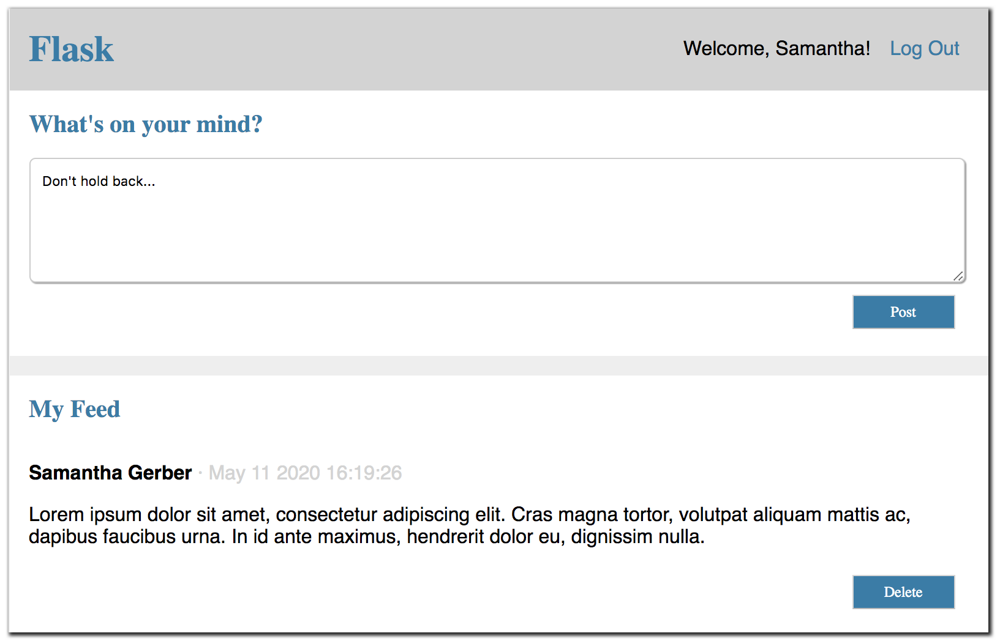

# Flask-Forum

## Description

This application acts as a simple message board where users register and login to post messages and comment on messages.

  

User registers an account with email address and password. Password is encrypted and stored in the MySQL database. Once the account is created, user can login.

 

User can post a message that will display to all users on the platform.

 

User can comment on messages to communicate with other users. They can delete their own comments and posts if needed.

## Built With
Python, MySQL, Flask, HTML, CSS

## Installation

Check that you have the installs found in requirements.txt. Create and activate the appropriate virtual environment. 

Execute the my_db.sql file in your MySQL server.

Open mysqlconnection.py and insert your local host, username, and password to ensure proper connection.

Navigate to the downloaded folder in your terminal. Run the following command.

‘’’ mac/bash
$ python3 server.py
‘’’

or

‘’’ windows/cmd
$ python server.py
‘’’

Go to localhost:5000 in your web browser.
